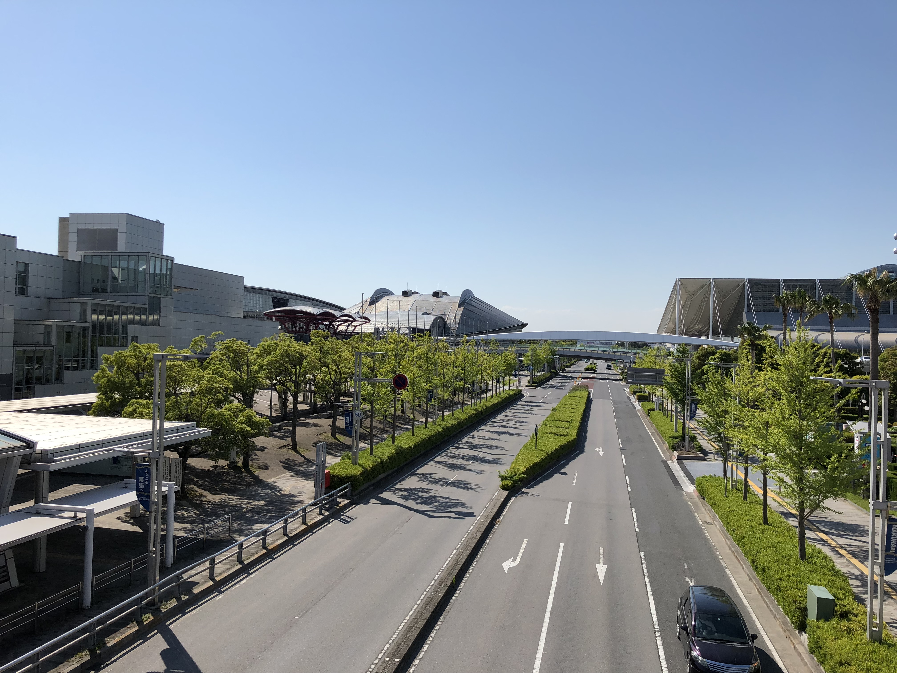
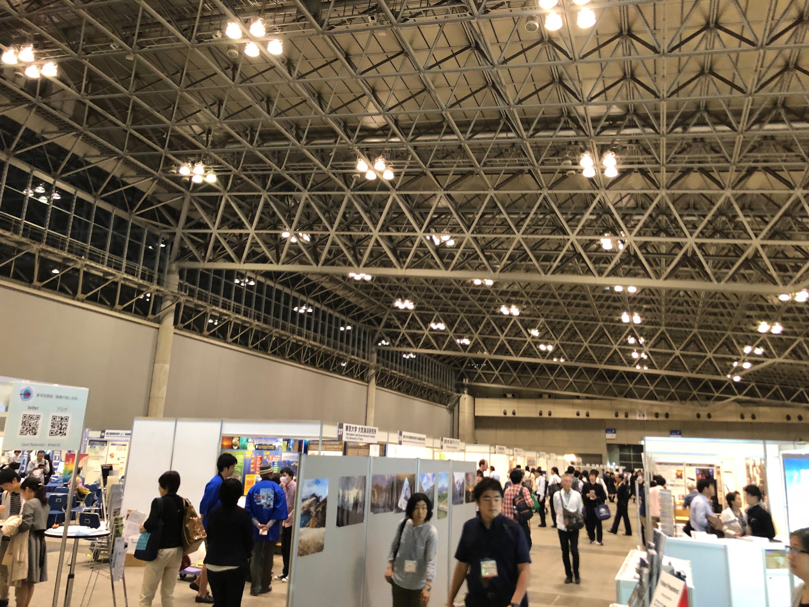

2018年5月20日−24日の5日間、千葉県・幕張メッセにて Japan Geoscience Union (JpGU) Meeting 2018 が開催されました。

三好研からは三好教授、梅田講師(現准教授)、今田講師、M2小林、M1伊藤、渡邉が発表を行いました。

<figure style="text-align: center;">
  
  <figcaption>会場の幕張メッセ</figcaption>
</figure>

<figure style="text-align: center;">
  
  <figcaption>ポスター会場。手前には各企業のブース、奥にはポスターが展示してあります。</figcaption>
</figure>
