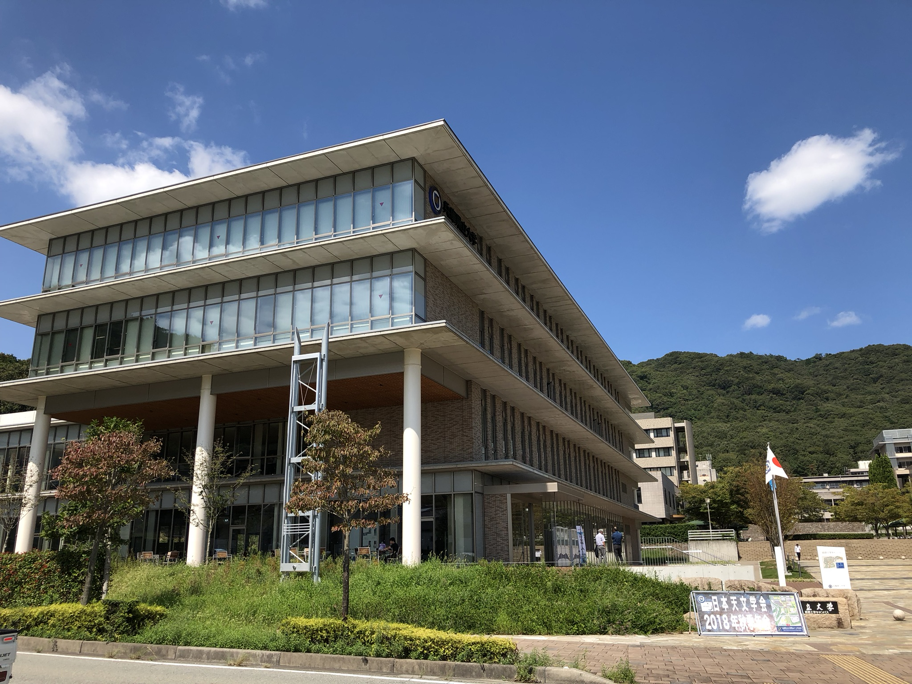
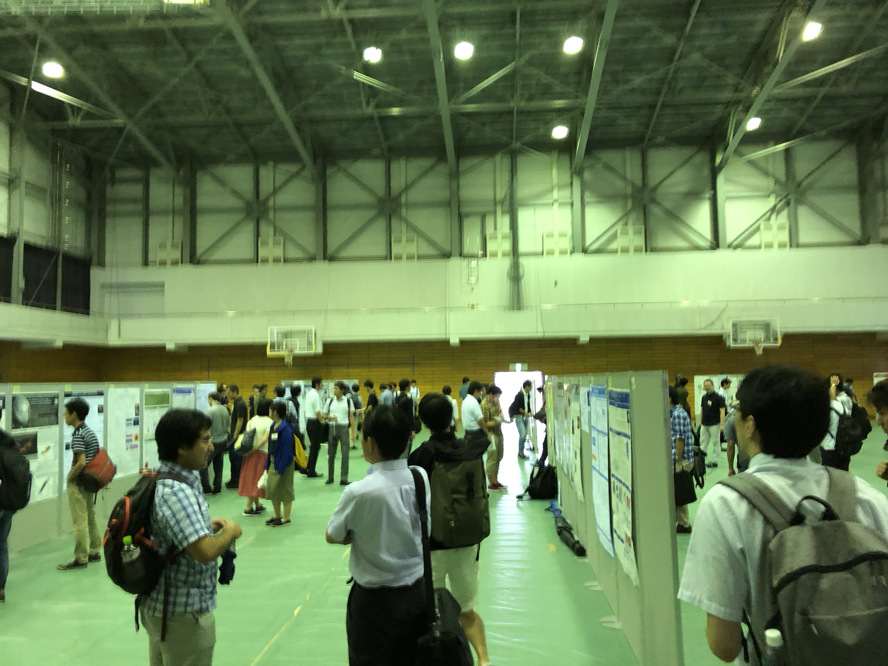

2018年9月19日−21日の3日間、姫路市・兵庫県立大学にて日本天文学会2018年秋季年会が開催されました。

三好研からは今田講師、M2近藤、M1渡邉が口頭発表を行いました。

<figure style="text-align: center;">
  
  <figcaption>会場の兵庫県立大学姫路書写キャンパス</figcaption>
</figure>

<figure style="text-align: center;">
  
  <figcaption>ポスター会場。ポスター作成者による短い口頭発表もありました。</figcaption>
</figure>
