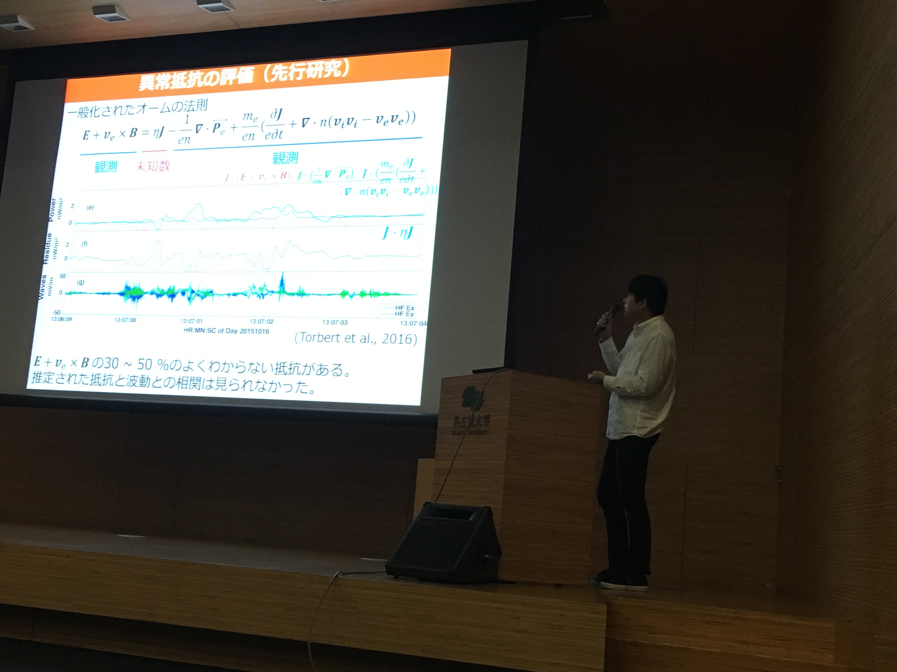

2018年11月23日−27日の5日間、名古屋大学にて地球電磁気・地球惑星圏学会 (SGEPSS) が開催されました。

三好研からは三好教授、M2小林、M1伊藤が口頭発表、梅田准教授がポスター発表を行いました。

<figure style="text-align: center;">
  
  <figcaption>M2小林による口頭発表の様子。日本語セッションのほか英語（特別）セッションも行われました。</figcaption>
</figure>
