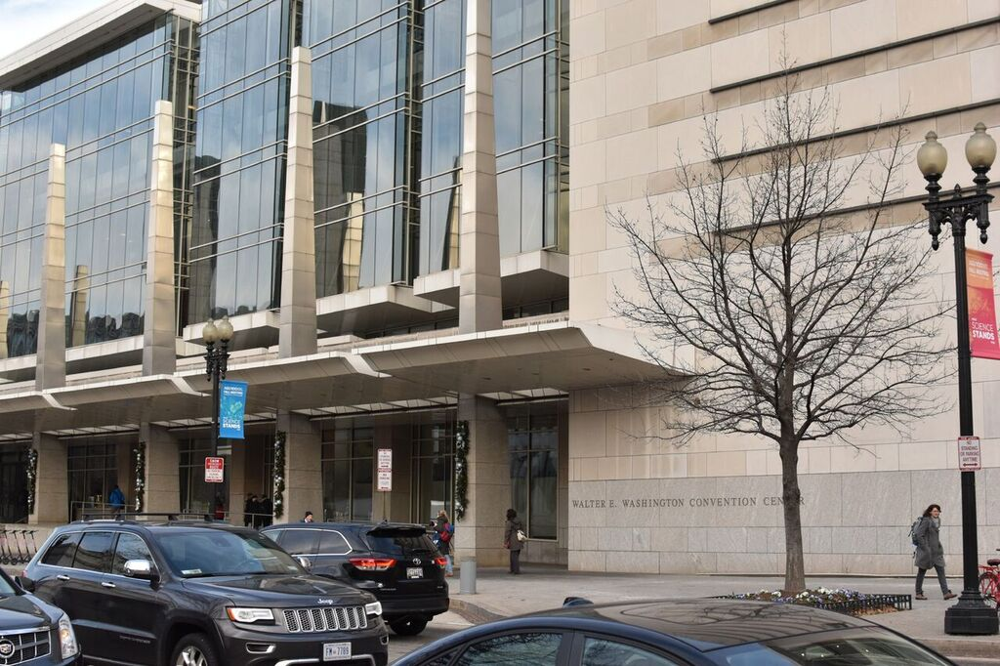
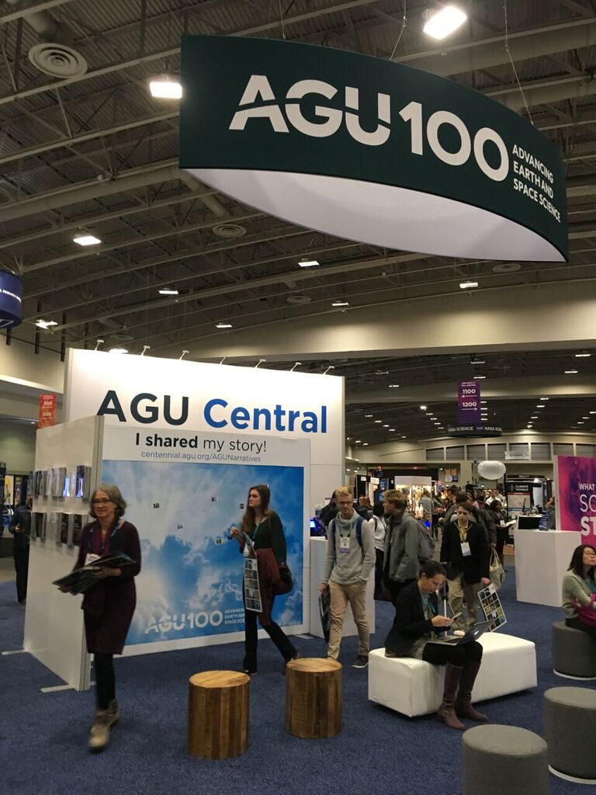

2018年12月10日−14日の5日間、アメリカ合衆国・ワシントンD.C.にて American Geophysical Union (AGU) 2018 Fall meeting が開催されました。

三好研からは三好教授が口頭発表、M2小林がポスター発表を行いました。

<figure style="text-align: center;">
  
  <figcaption>会場のワシントンコンベンションセンター</figcaption>
</figure>

<figure style="text-align: center;">
  
  <figcaption>会場内部の様子</figcaption>
</figure>
