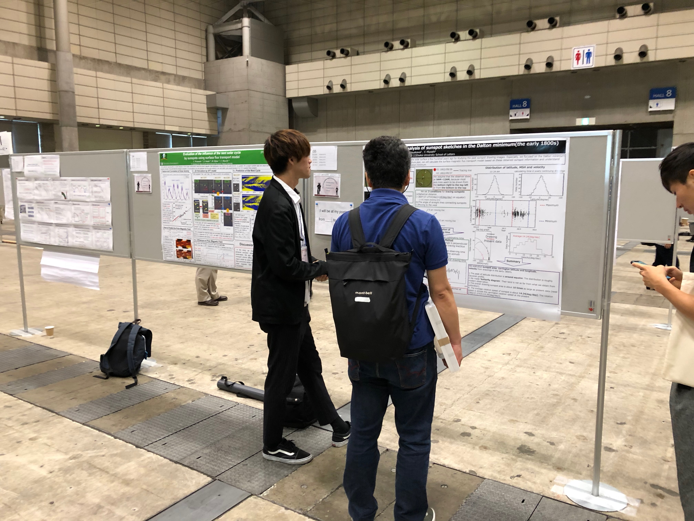
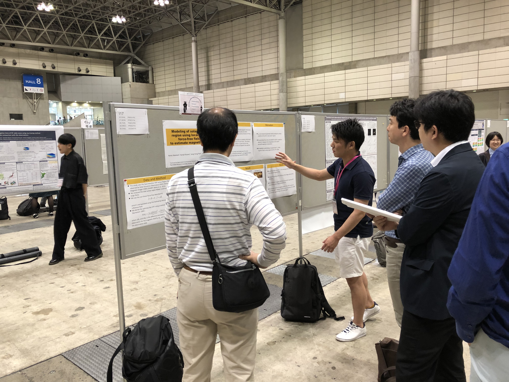
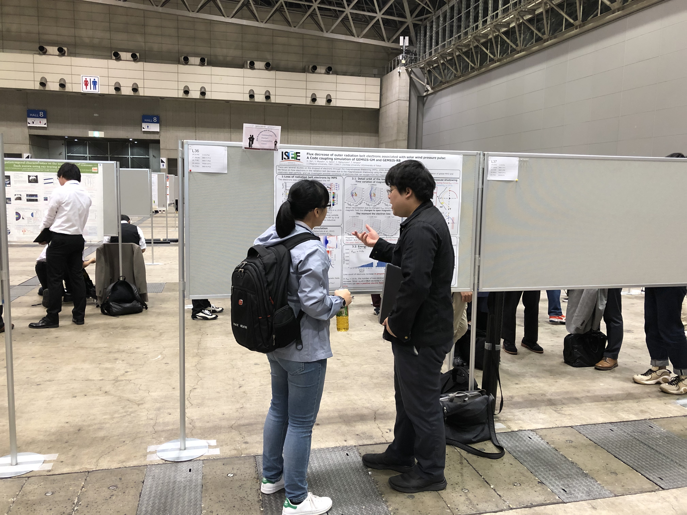
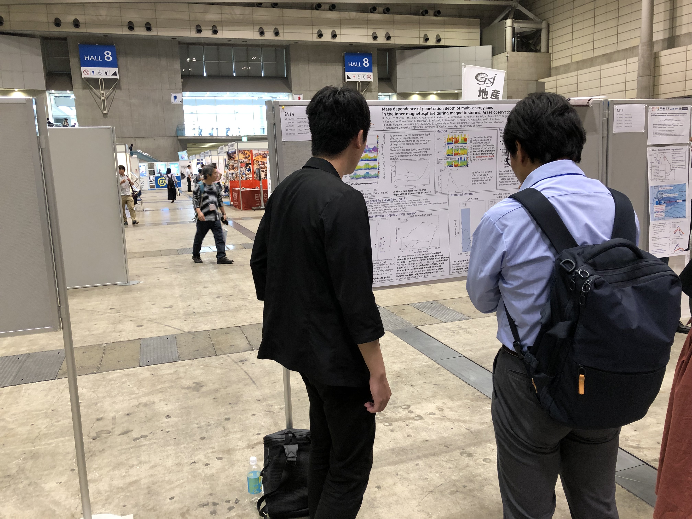
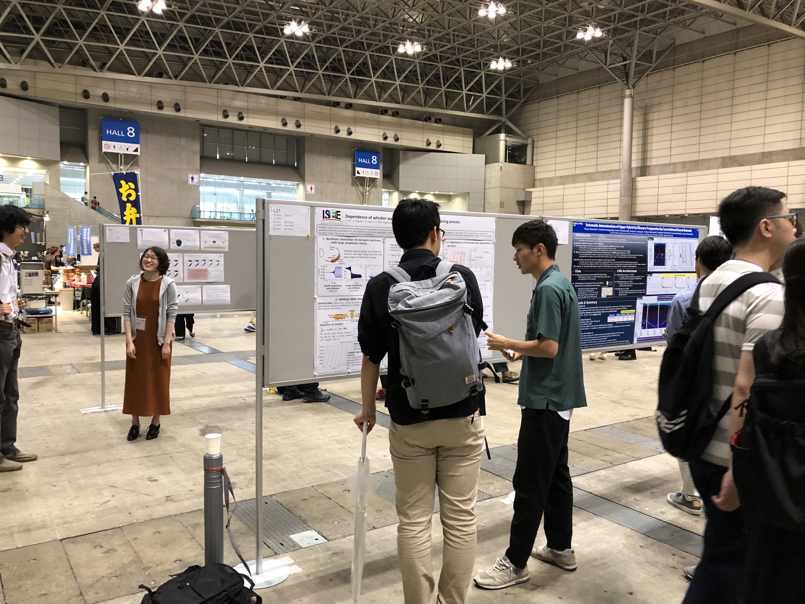

2019年5月26日−30日の5日間、千葉県・幕張メッセにて Japan Geoscience Union (JpGU) Meeting 2019 が開催されました。

三好研からは三好教授、梅田准教授、今田講師、M2伊藤、渡邉、M1伊藤、采女が発表を行いました。

<figure style="text-align: center;">
  

    
    
    
    
    
  

  <figcaption>ポスター発表の様子</figcaption>
</figure>
