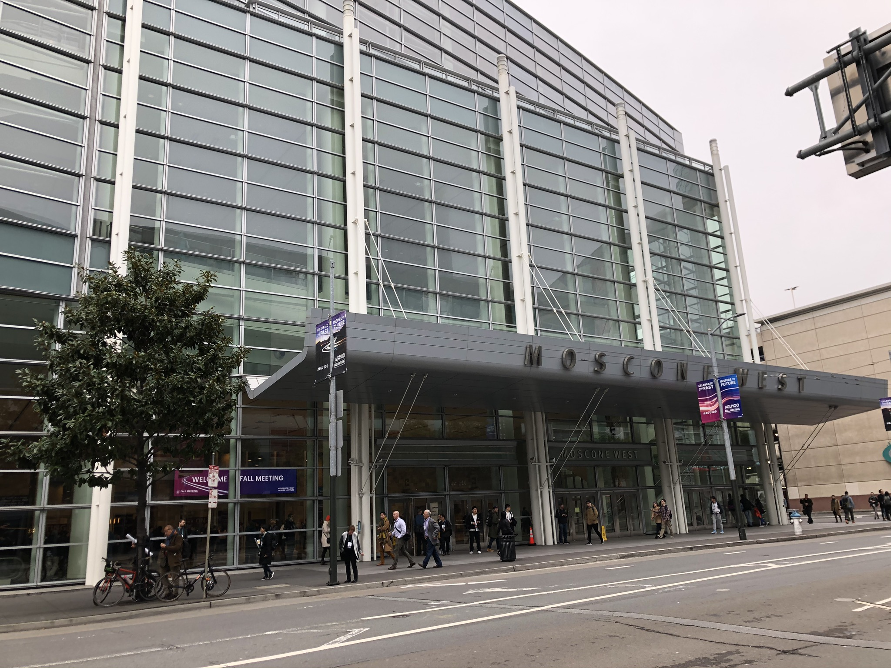
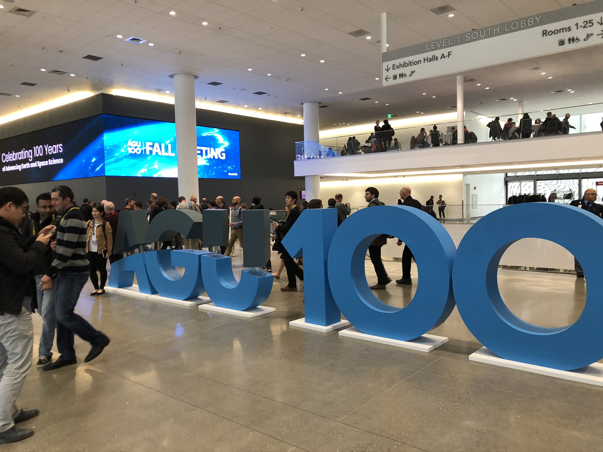
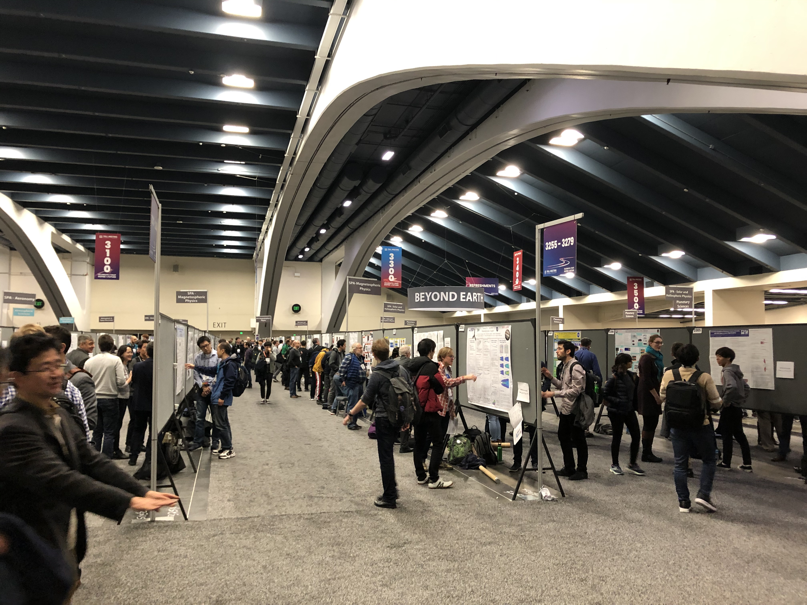

2019年12月9日−13日の5日間、アメリカ合衆国・サンフランシスコにて American Geophysical Union (AGU) 2019 Fall meeting が開催されました。

三好研からは三好教授が口頭発表、M2伊藤・渡邉がポスター発表を行いました。

毎年20,000人以上の参加人数を誇る地球物理学最大の学会で、サンフランシスコでの開催は3年ぶりでした。

<figure style="text-align: center;">
  
  <figcaption>会場のモスコーニセンター。市街地にとても近い場所にある。Moscone West/North/South の3棟から成る。</figcaption>
</figure>

<figure style="text-align: center;">
  
  <figcaption>100周年を記念するモニュメント。AGUは1919年創立。非常に歴史ある学会である。</figcaption>
</figure>

<figure style="text-align: center;">
  
  <figcaption>Moscone South のポスター会場。端から端まで約150メートルととても広い。</figcaption>
</figure>
