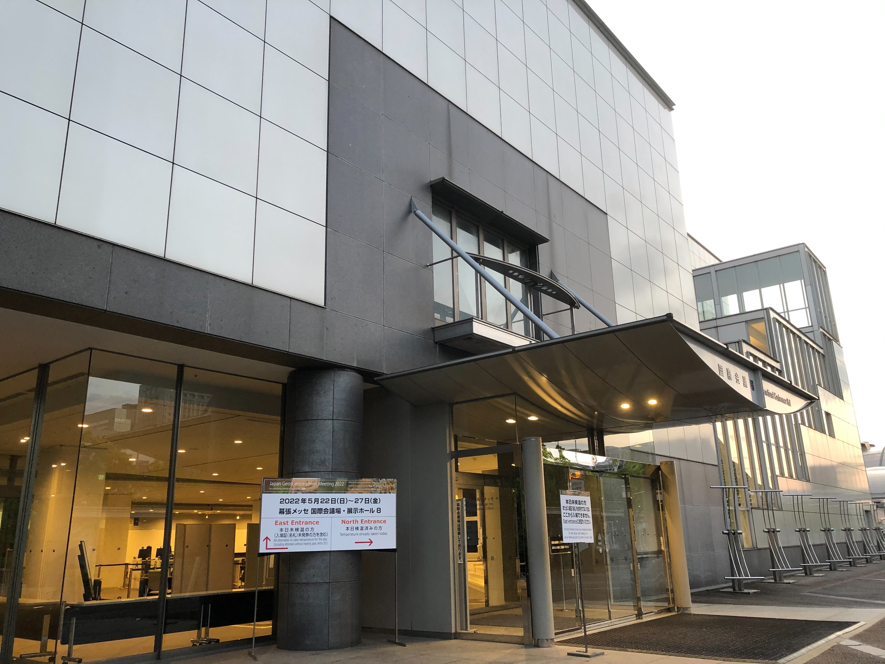
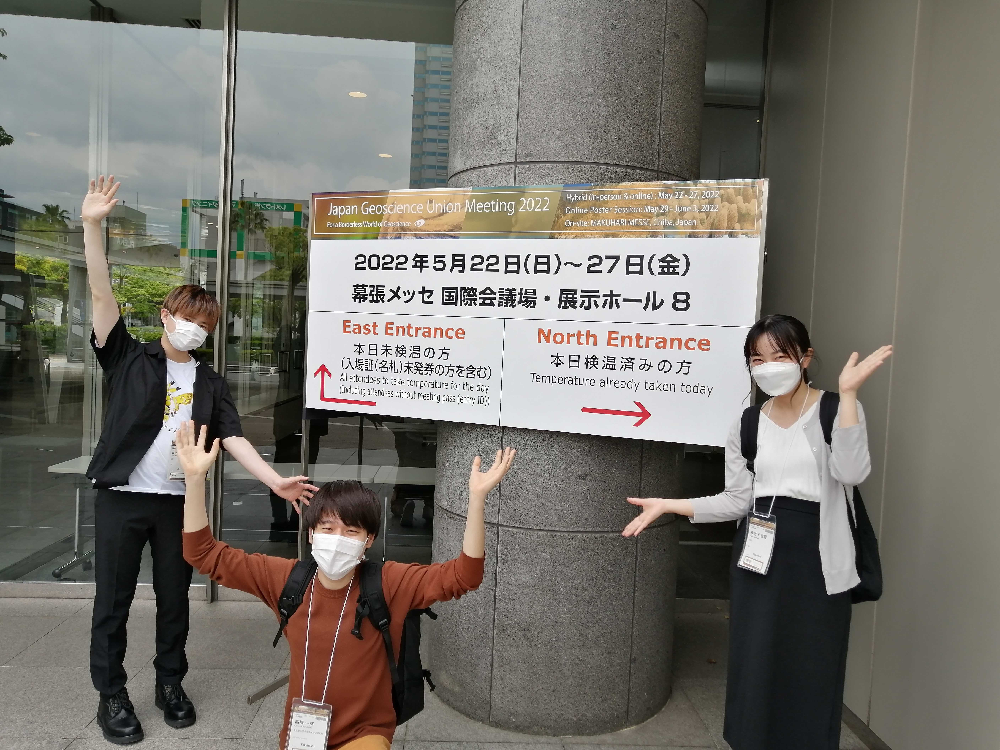
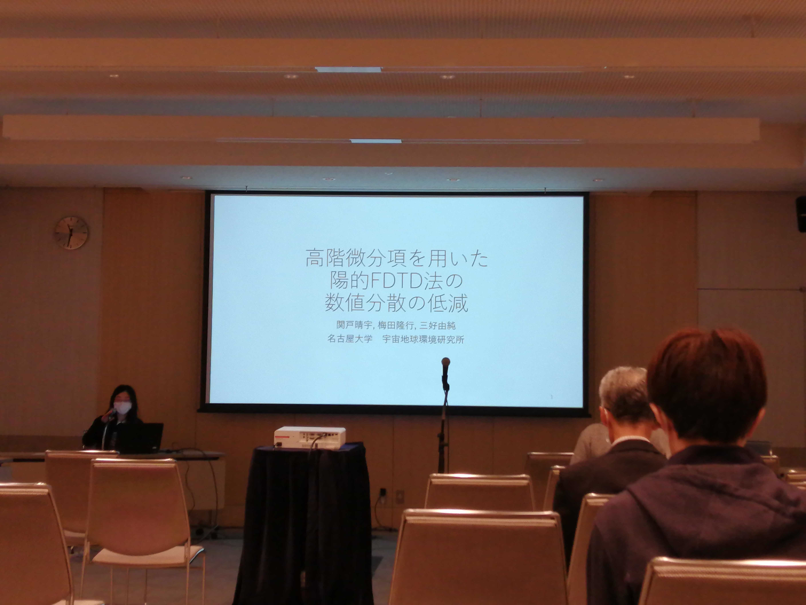

2022年5月22日-6月3日の13日間、千葉県・幕張メッセ (5月22日-27日) とオンラインのハイブリッド形式にて Japan Geoscience Union (JpGU) Meeting 2022 が開催されました。

三好研からは三好教授、梅田准教授、M2池場、高橋、辻村、M1関戸、永谷、森井が発表を行いました。

<figure style="text-align: center;">
  
  <figcaption>会場の幕張メッセ</figcaption>
</figure>

<figure style="text-align: center;">
  
  <figcaption>会場前にて</figcaption>
</figure>

<figure style="text-align: center;">
  
  <figcaption>口頭発表の様子</figcaption>
</figure>
