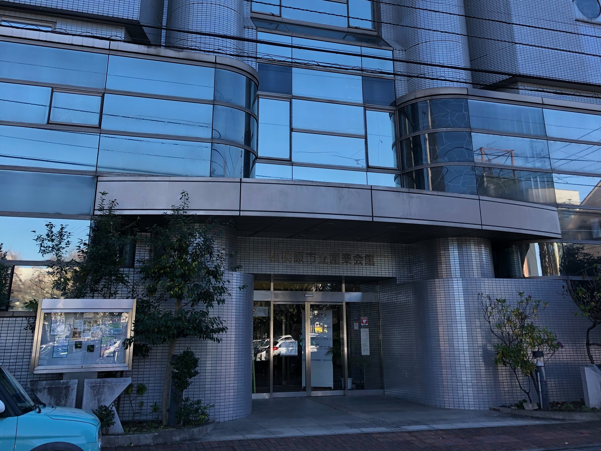

2022年11月4日-7日の4日間、相模原市立産業会館・けやき会館とオンラインのハイブリッド形式にて地球電磁気・地球惑星圏学会 (SGEPSS) が開催されました。

三好研からは三好教授、梅田准教授、M2池場、高橋、M1尾林、関戸、永谷が発表を行いました。

<figure style="text-align: center;">
  
  <figcaption>会場の相模原市立産業会館</figcaption>
</figure>
