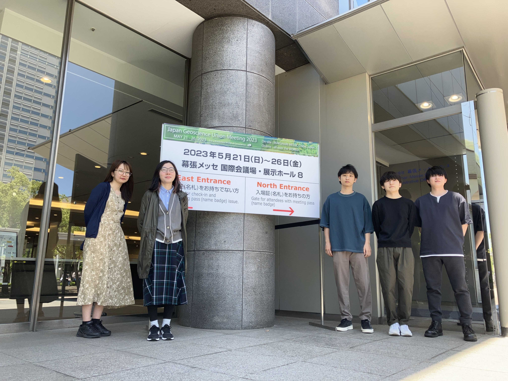
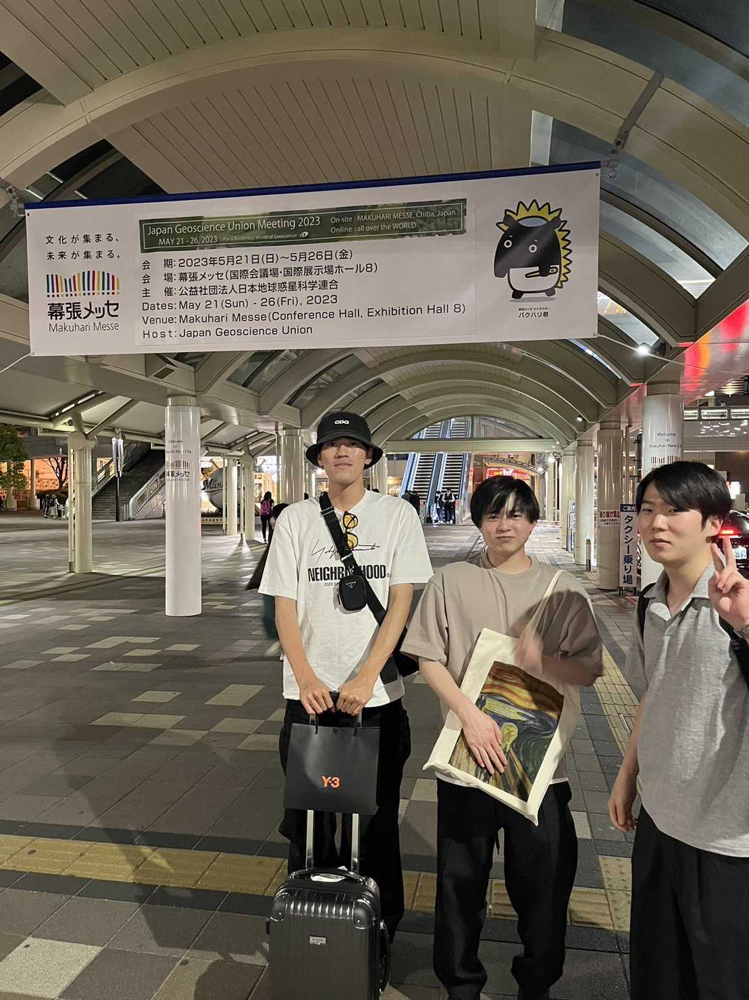
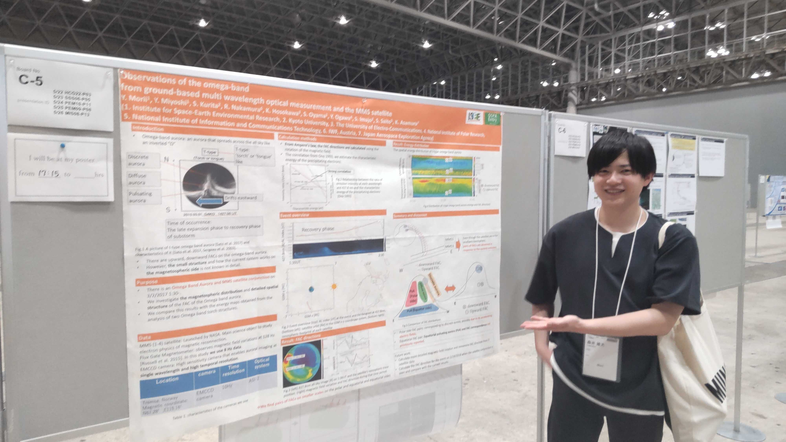
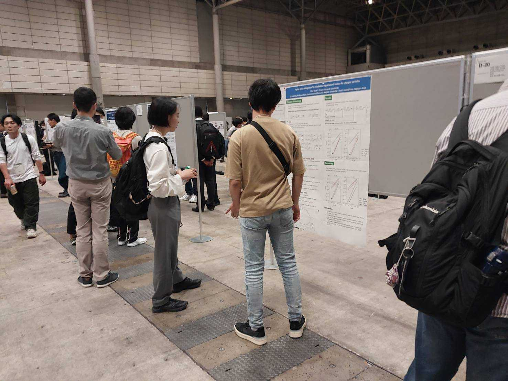
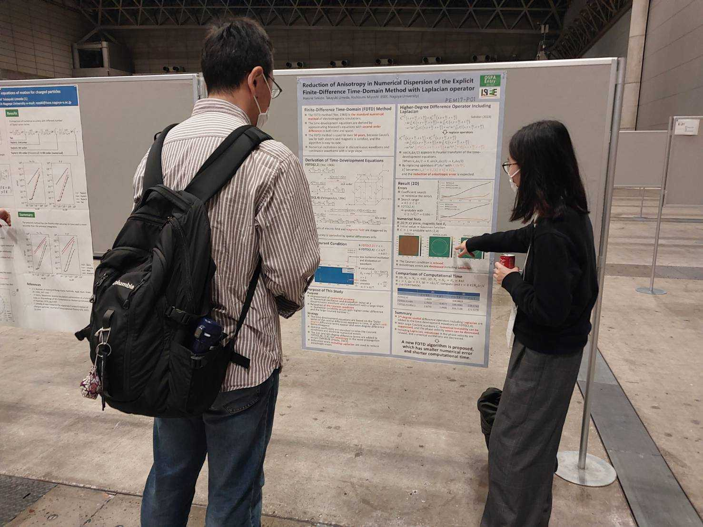

2023年5月21日-5月26日に千葉県・幕張メッセとオンラインのハイブリッド形式にて Japan Geoscience Union (JpGU) Meeting 2023 が開催されました。

三好研からは三好教授、梅田准教授、M2関戸、永谷、森井、尾林、M1出井、尾﨑、寺澤、西宮が発表を行いました。

<figure style="text-align: center;">
  

  
  
  

  <figcaption>会場前にて</figcaption>
</figure>

<figure style="text-align: center;">
  

  
  
  
  

  <figcaption>ポスター発表の様子</figcaption>
</figure>
