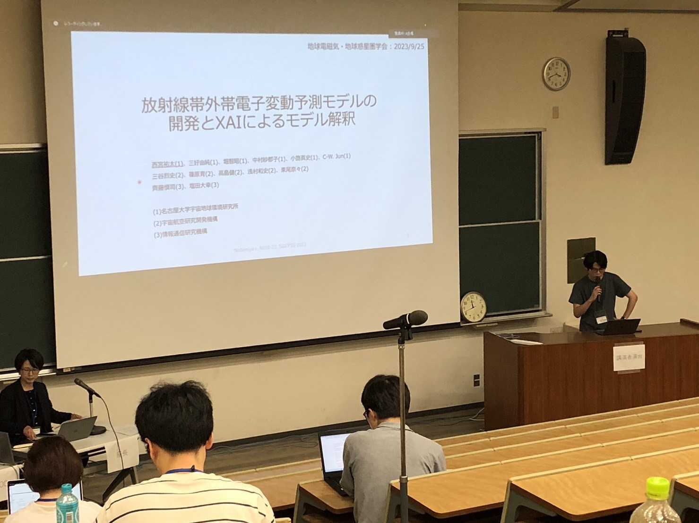
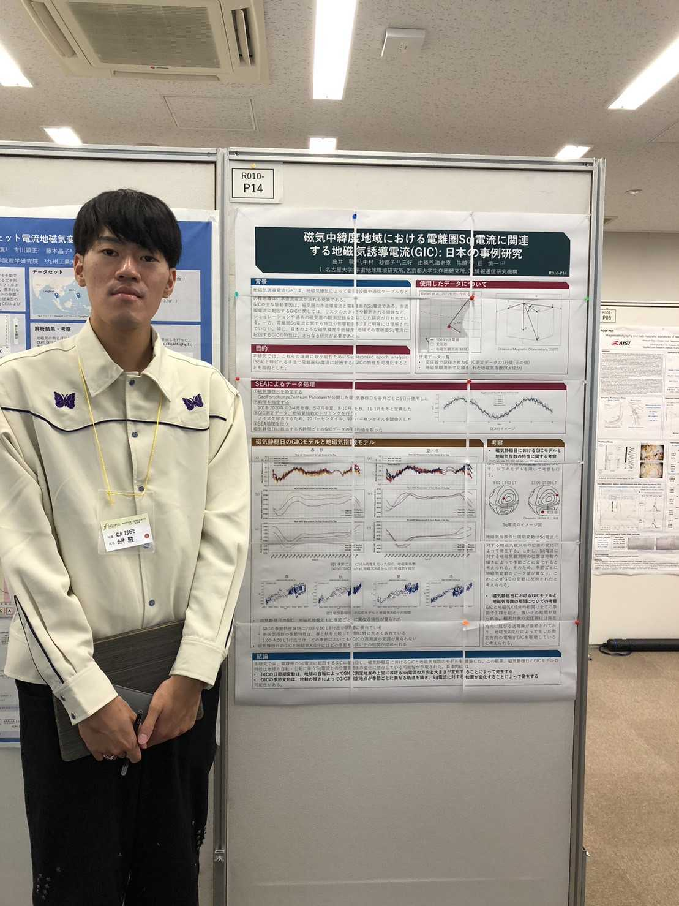
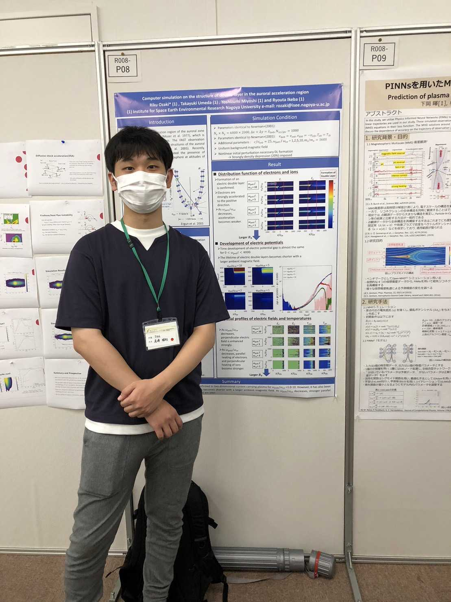
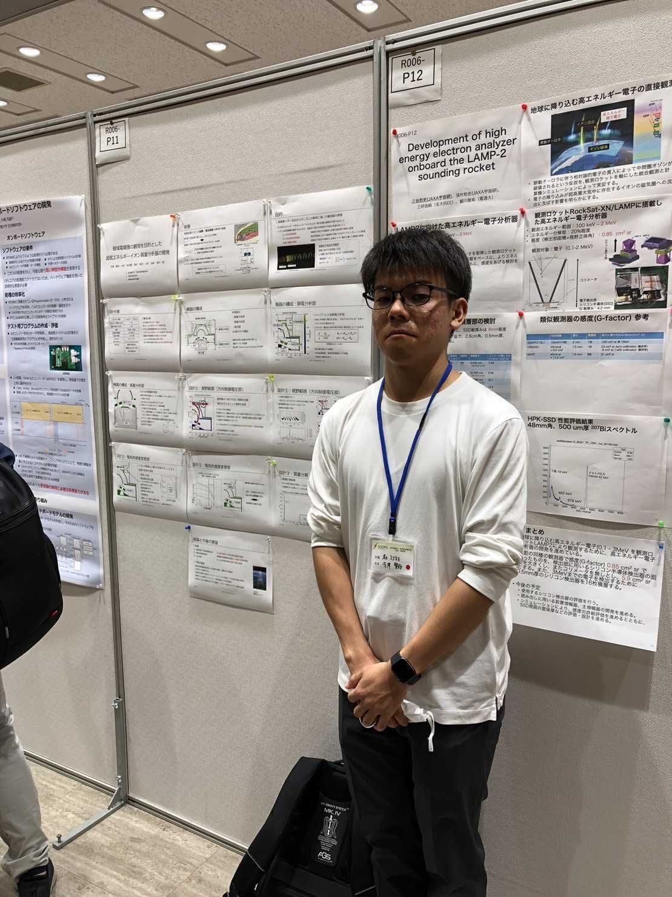

2023年9月23日-27日の5日間、東北大学とオンラインのハイブリッド形式にて 地球電磁気・地球惑星圏学会 (SGEPSS) が開催されました。

三好研からは三好教授、梅田准教授、M2森井、尾林、関戸、永谷、M1尾﨑、出井、寺澤、西宮が発表を行いました。

<figure style="text-align: center;">
  
  <figcaption>口頭発表の様子</figcaption>
</figure>

<figure style="text-align: center;">
  

  
  
  
  

  <figcaption>ポスター発表の様子</figcaption>
</figure>
