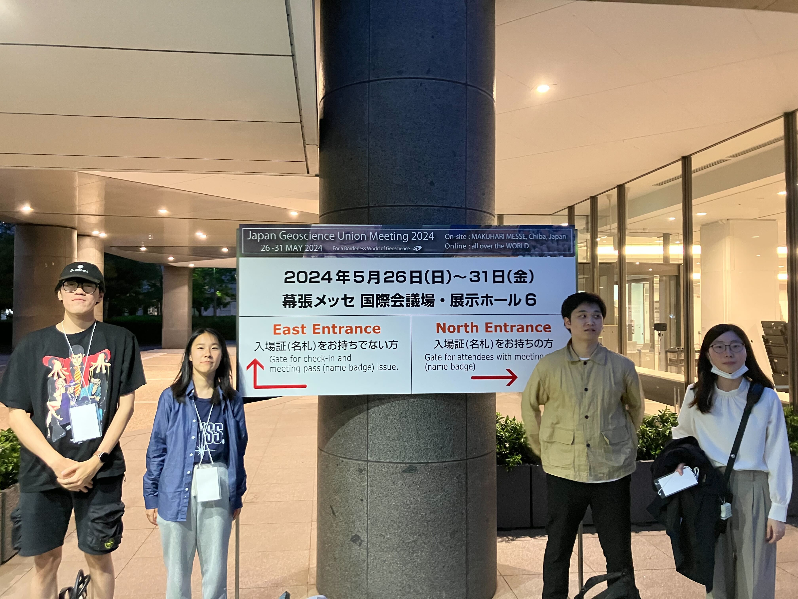
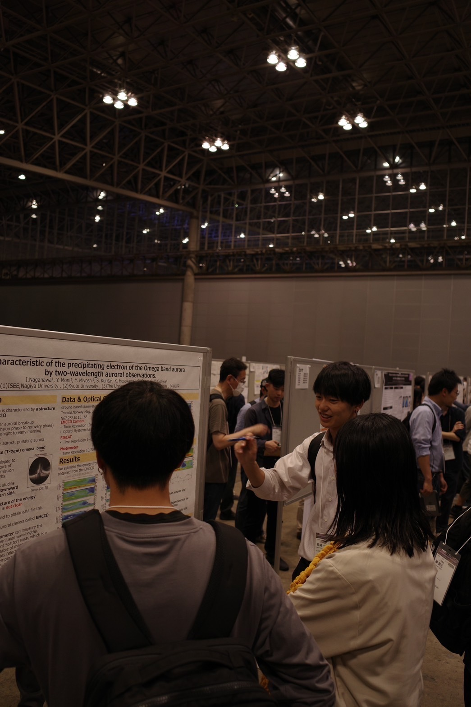
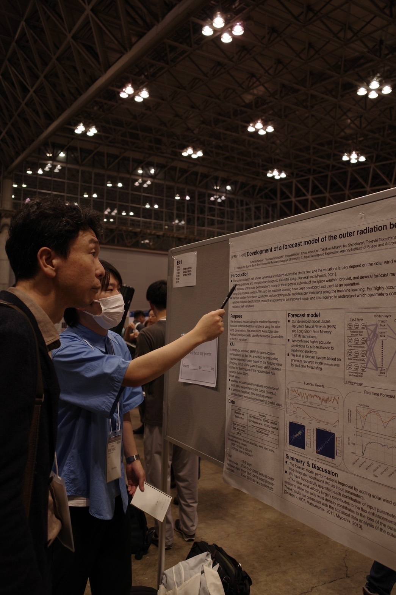
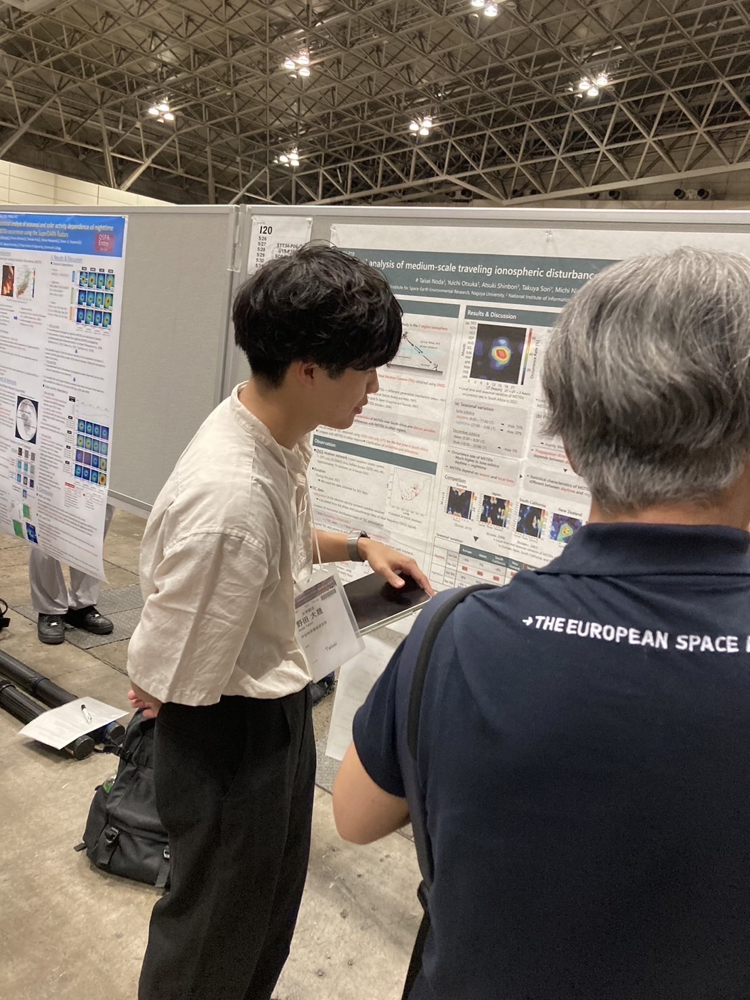
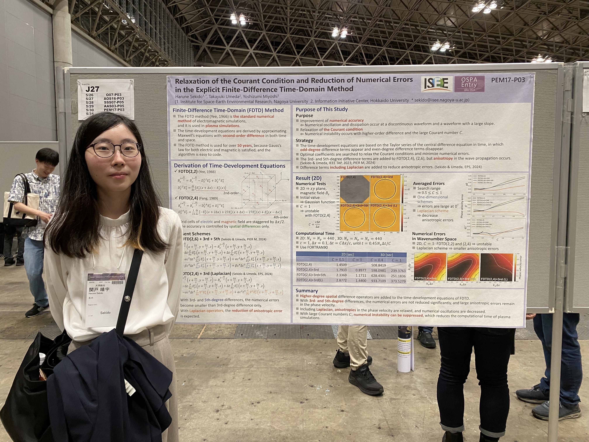
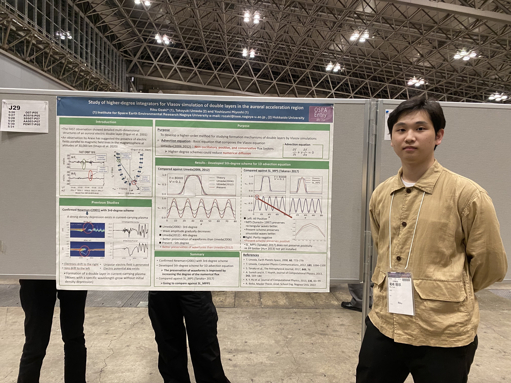
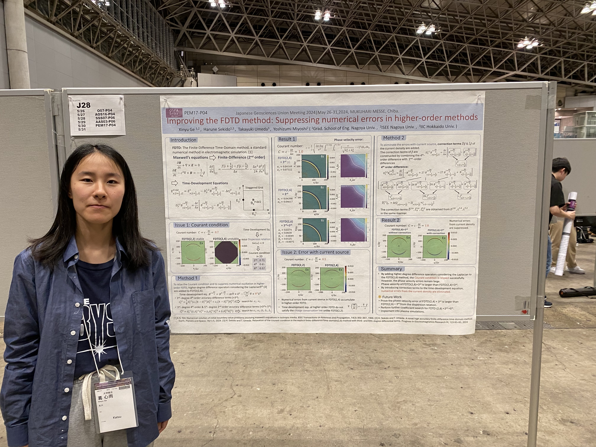

2024年5月26日-5月31日の5日間、千葉県・幕張メッセとオンラインのハイブリッド形式にて Japan Geoscience Union (JpGU) Meeting 2024 が開催されました。

三好研からは三好教授、D1関戸、M2出井、尾﨑、寺澤、西宮、M1葛、長縄、西田、野田が発表を行いました。

<figure style="text-align: center;">
  
  <figcaption>会場の幕張メッセ</figcaption>
</figure>

<figure style="text-align: center;">
  

  
  
  
  
  
  
  

  <figcaption>ポスター発表の様子</figcaption>
</figure>
