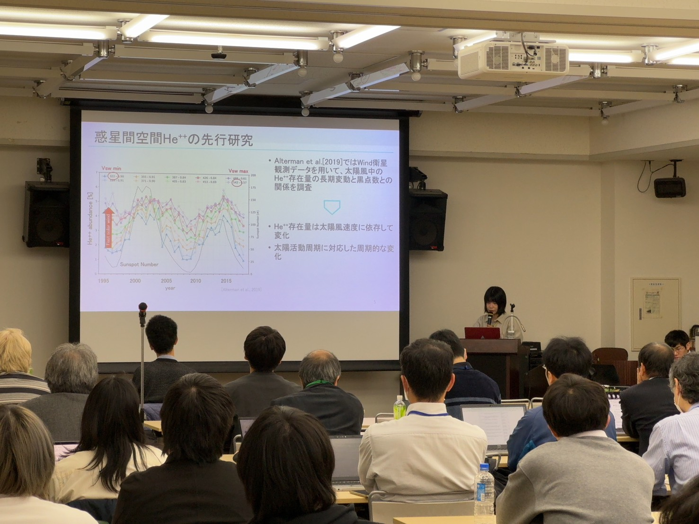
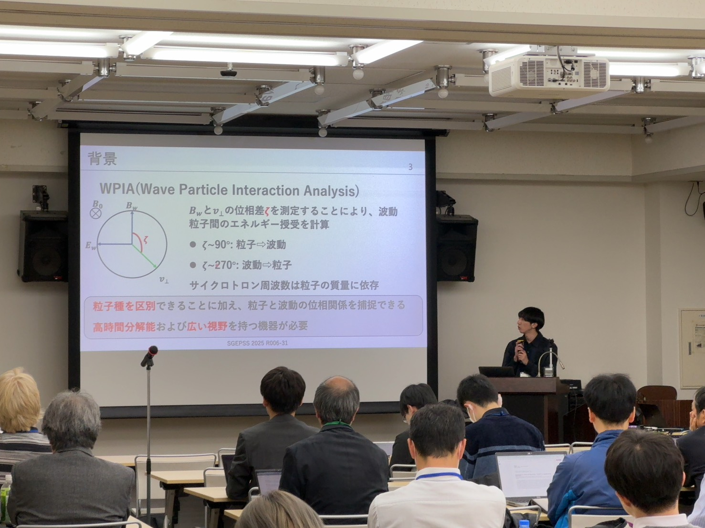

2025年11月23日-27日の5日間、神戸大学とオンラインのハイブリッド形式にて 地球電磁気・地球惑星圏学会 (SGEPSS) が開催されました。

三好研からは三好教授、飯島准教授、M2西田、野田、M1西野、竹内、横家が発表を行いました。

<figure>
  
  <figcaption>M2西田の口頭発表の様子</figcaption>
</figure>

<figure>
  
  <figcaption>M1竹内の口頭発表の様子</figcaption>
</figure>
