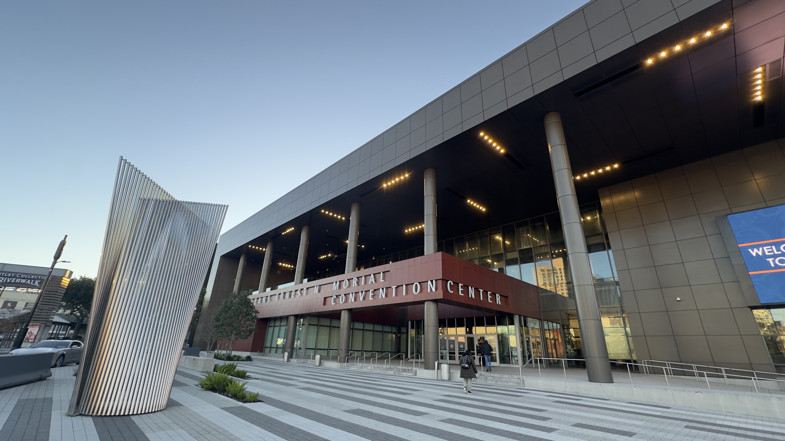
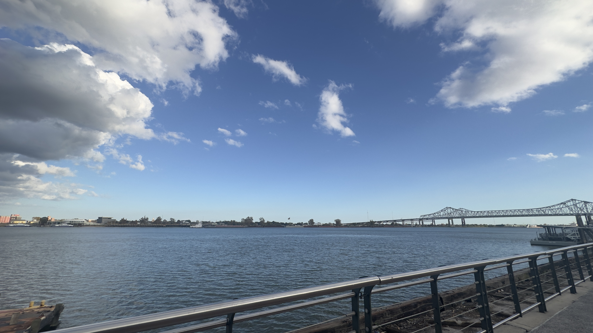
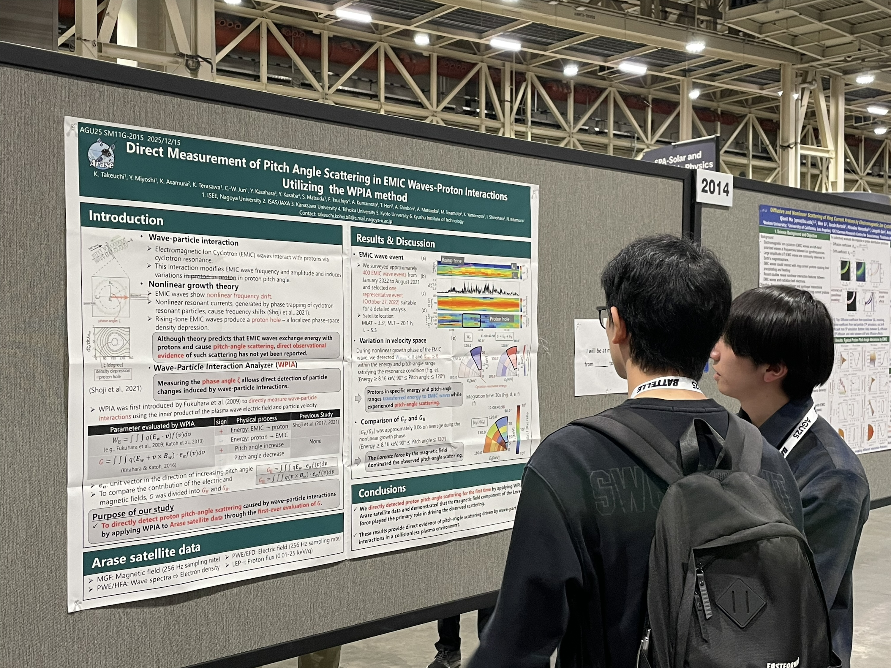

2025年12月15日−19日の5日間、アメリカ合衆国・ニューオリンズにてAmerican Geophysical Union (AGU) 2025 Fall meetingが開催されました。

三好研からは三好教授が招待講演、M1竹内がポスター発表を行いました。

<figure>
  
  <figcaption>会場のNew Orleans Ernest N. Morial Convention Center</figcaption>
</figure>

<figure>
  
  <figcaption>会場周辺のミシシッピ川</figcaption>
</figure>

<figure>
  
  <figcaption>ポスターセッションの様子</figcaption>
</figure>
