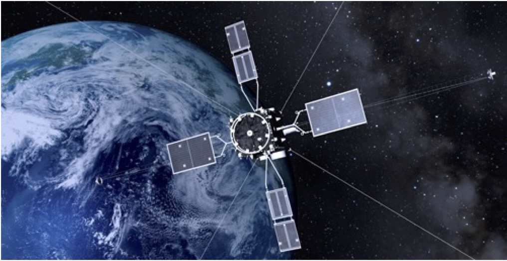
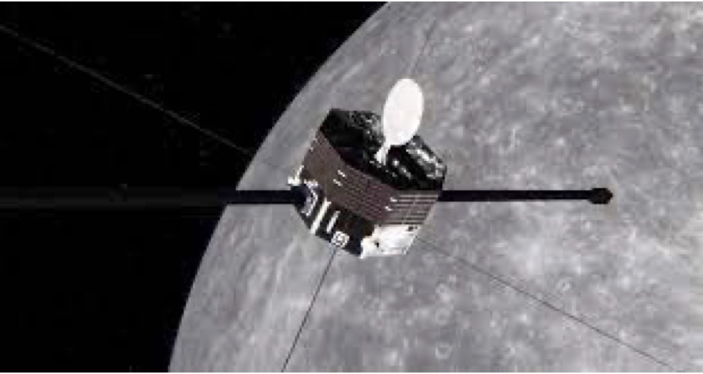
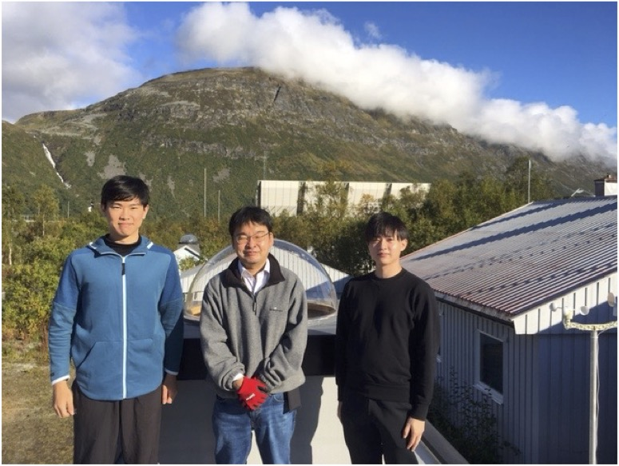
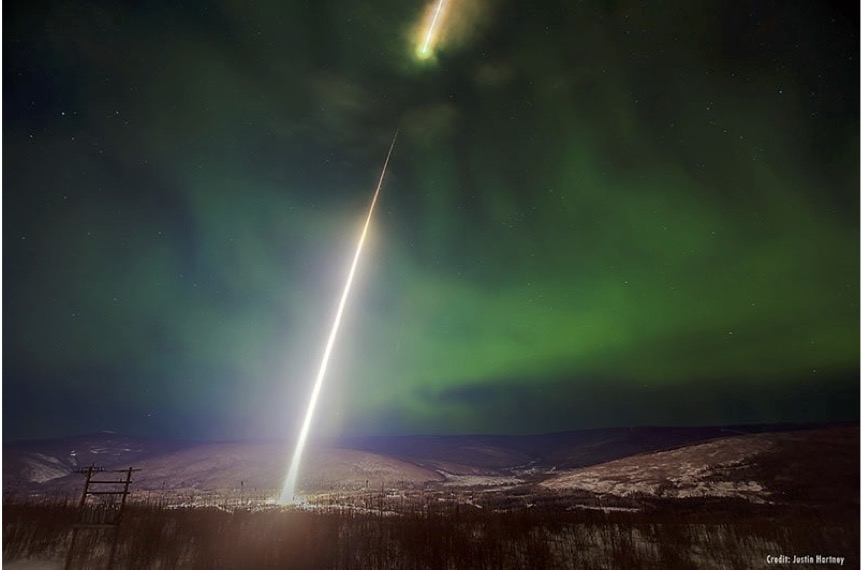

ジオスペースで起こる様々な現象のうち、オーロラや放射線帯の高エネルギー粒子の変動、地球起源のプラズマ流出過程といった宇宙環境変動について、JAXAの科学衛星「あらせ」の最新のデータを用いて研究を精力的に進めています。また、2026年に水星に到着する科学衛星「みお」や太陽観測衛星「ひので」などのデータ解析も進めていきます。

<figure style="text-align: center;">
  

  
  
  

  <figcaption>磁気圏観測衛星あらせ(左; &copy;JAXA)と水星観測衛星みお(右; &copy;JAXA/ESA)</figcaption>
</figure>

海外に設置した独自の高感度オーロラカメラの画像を分析し、オーロラの様々な性質を調べています。観測ロケット実験にも参加し、新しい観測機器の開発も進めています。

<figure style="text-align: center;">
  

  
  
  

  <figcaption>アラスカでのオーロラ観測ロケットの打ち上げ</figcaption>
</figure>
