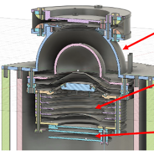
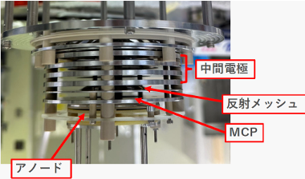
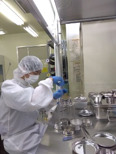

地球から宇宙空間へイオン流出を解明するために、超低エネルギーかつイオンの種類
（酸素、窒素、分子イオンの分離）などを実現できる世界初の装置を開発しました。
機器設計から、デザイン、製造、テストまでを実施しています。
将来の北欧ロケット実験、2030年代の人工衛星に搭載を目指しています。

<figure style="text-align: center;">
  

  
  
  

  <figcaption>開発した観測装置の内部構造</figcaption>
</figure>

<figure style="text-align: center;">
  
  <figcaption>観測装置開発中の様子</figcaption>
</figure>
