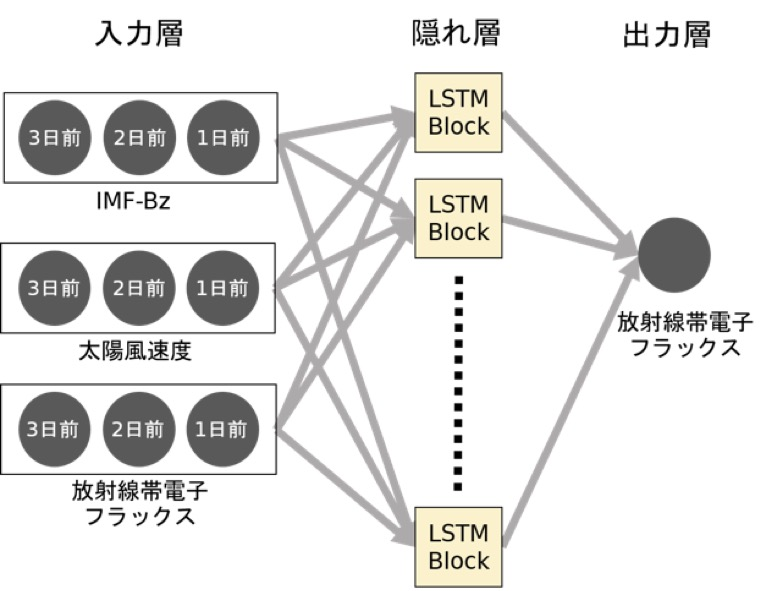
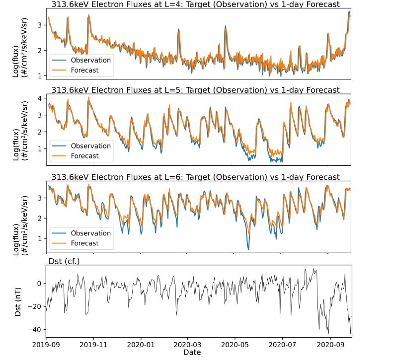

ニューラルネットワークなどの機械学習手法(AI)を用いて、既存の観測データから観測できなかった物理量を再現し、未来の宇宙環境変動を予測するシステムを構築しています。

<figure style="text-align: center;">
  

  
  
  

  <figcaption>Recurrent Neural Networkを用いた宇宙放射線の予測結果</figcaption>
</figure>
